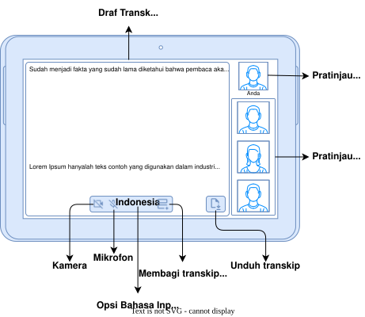
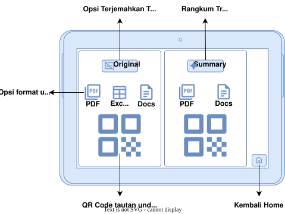

# KONSEP

## System Design

* **Pusat Pemrosesan (Server):** Berjalan di atas ekosistem Linux Server yang menaungi MySQL Server untuk manajemen database, Server Mjpeg Streamer untuk mendistribusikan video, dan mesin AI Summary  untuk merangkum percakapan.
* **Jalur Komunikasi (Local Network):** Seluruh aliran data antara server dan perangkat klien terhubung secara eksklusif dan cepat melalui Local Network.
* **Antarmuka Pengguna (Tab User):** Perangkat klien menggunakan SQLite dan MySQL Client untuk penyimpanan data lokal, menangkap video lewat Stream Camera , serta menjalankan pemrosesan bahasa langsung lewat AI Transcript dan AI Translate.

## Pages

#### Main Page

Terdapat layar awal dengan indikator untuk menghubungkan ke server utama , status Terhubung , dan tombol Mulai untuk memasuki sesi konferensi.

#### Home

* **Area Draf Transkripsi:** Bagian layar utama yang paling luas didedikasikan untuk menampilkan **Draf Transk...** (Transkripsi), memastikan pengguna memiliki ruang baca yang nyaman untuk mengikuti teks percakapan  *real-time* .
* **Panel Visual Peserta:** Sisi kanan antarmuka secara khusus mengalokasikan ruang vertikal untuk **Pratinjau...** kamera pengguna (berlabel "Anda") di posisi teratas, diikuti oleh barisan kotak **Pratinjau...** untuk menampilkan kamera dari anggota rapat lainnya.
* **Kontrol Akses Media:** Tepat di bagian bawah area transkripsi, terdapat bilah alat (toolbar) yang memuat kontrol perangkat keras esensial, yaitu tombol **Kamera** dan **Mikrofon** untuk mengatur jalannya komunikasi audio-visual.
* **Manajemen Notulensi:** Di bagian bawah juga tersedia akses cepat ke alat penyesuaian teks, meliputi **Opsi Bahasa Inp...** (Input) untuk mengatur bahasa transkripsi, pengaturan  **Membagi transkip...** , serta tombol **Unduh transkip** di sudut kanan untuk mengekspor teks secara instan.

#### Preview Member

* **Fokus Transkripsi Spesifik:** Area tampilan utama di tengah layar kini dialokasikan khusus untuk menampilkan **Draf Transkip Angg...** (Anggota). Ruang baca yang luas ini memastikan pengguna bisa menyimak detail pernyataan dari satu orang peserta secara fokus.
* **Indikator Sorotan Visual:** Panel di sisi kanan tetap mempertahankan tata letak **Pratinjau K...** (Kamera pengguna/Anda) di atas dan barisan **Pratinjau Kamera A...** (Anggota) di bawahnya. Terdapat indikator *highlight* berupa bingkai ganda pada salah satu kotak anggota, yang menandakan secara jelas siapa peserta yang sedang dipilih atau disorot oleh sistem saat itu.
* **Akses Terjemahan Instan:** Di area bawah kotak transkripsi utama, disematkan sebuah tombol aksi cepat bernama **Terjemah Transkip** (lengkap dengan ikon karakter bahasa). Penempatan tombol ini dirancang agar pengguna bisa dengan satu ketukan langsung menerjemahkan percakapan dari anggota yang sedang berbicara, sangat cocok untuk skenario rapat multinasional.

#### Download

* **Pemilahan Jenis Dokumen:** Layar terbagi secara simetris dengan indikator navigasi di bagian atas. Panel sebelah kiri berfokus pada **Opsi Terjemahkan T...** (Transkrip) untuk dokumen percakapan penuh, sedangkan panel kanan didedikasikan khusus untuk **Rangkum Tr...** (Transkrip) yang berisi intisari atau notulensi ringkas hasil olahan AI.
* **Fleksibilitas Format File:** Pada masing-masing panel, disematkan deretan ikon **Opsi format u...** (unduhan). Pengguna diberikan kebebasan untuk mengekspor data rapat sesuai kebutuhan administratif, baik itu dalam bentuk PDF, Spreadsheet (tabel data), maupun Docs (dokumen teks).
* **Distribusi Instan via Kode QR:** Elemen visual paling dominan di halaman ini adalah kotak besar untuk **QR Code tautan und...** (unduhan). Fitur ini merupakan solusi distribusi nirkabel yang inovatif; peserta rapat cukup memindai kode QR di layar menggunakan ponsel mereka untuk mengunduh dokumen seketika, menghilangkan kebutuhan berbagi *link* manual atau berkirim  *email* .
* **Navigasi Penyelesaian Sesi:** Tepat di pojok kanan bawah, terdapat tombol aksi **Kembali Home** dengan ikon rumah. Ini bertindak sebagai titik penyelesaian sesi yang aman, memungkinkan pengguna menutup antarmuka unduhan dan mereset sistem kembali ke layar beranda awal.
